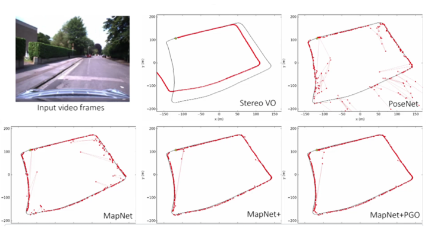
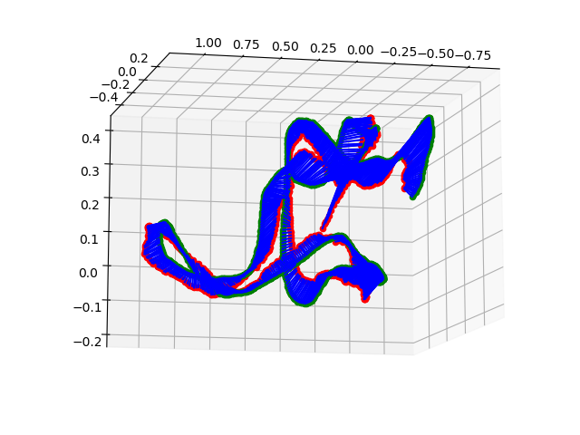
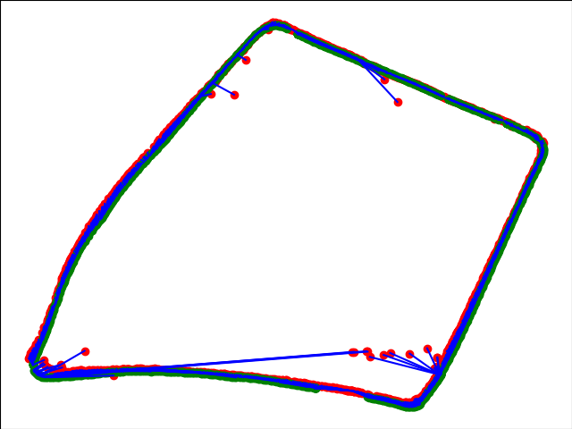

[](https://raw.githubusercontent.com/NVIDIA/FastPhotoStyle/master/LICENSE.md)

# Geometry-Aware Learning of Maps for Camera Localization 

## Citation
If you find this code useful for your research, please cite our paper

```
@inproceedings{mapnet2018,
  title={Geometry-Aware Learning of Maps for Camera Localization},
  author={Samarth Brahmbhatt and Jinwei Gu and Kihwan Kim and James Hays and Jan Kautz},
  booktitle={IEEE Conference on Computer Vision and Pattern Recognition (CVPR)},
  year={2018}
}
```

## Table of Contents
- [Documentation](#documentation)
- [Setup](#setup)
- [Data](#data)
- [Running the code](#running-the-code)
  - [Demo/Inference](#demo/inference)
  - [Train](#train)
  - [Network Attention Visualization](#network-attention-visualization)
  - [Other tools](#other-tools)
- [FAQ](#faq)
- [License](#license)

## Documentation 

This is the PyTorch implementation of our CVPR 2018 paper

"[Geometry-Aware Learning of Maps for Camera Localization](https://arxiv.org/abs/1712.03342)" - CVPR 2018 (Spotlight). [Samarth Brahmbhatt](https://samarth-robo.github.io/), [Jinwei Gu](http://www.gujinwei.org/), [Kihwan Kim](https://www.cc.gatech.edu/~kihwan23/), [James Hays](https://www.cc.gatech.edu/~hays/), and [Jan Kautz](http://jankautz.com/)

### A four-minute video summary (click below for the video)

[](https://www.youtube.com/watch?v=X6mF_IbOb4A)

## Setup

MapNet uses a Conda environment that makes it easy to install all dependencies.

1. Install [miniconda](https://docs.conda.io/en/latest/miniconda.html) with Python 2.7.

2. Create the `mapnet` Conda environment: `conda env create -f environment.yml`.

3. Activate the environment: `conda activate mapnet_release`.

4. Note that our code has been tested with PyTorch v0.4.1 (the environment.yml file should take care of installing the appropriate version).

## Data
We support the
[7Scenes](https://www.microsoft.com/en-us/research/project/rgb-d-dataset-7-scenes/)
and [Oxford RobotCar](http://robotcar-dataset.robots.ox.ac.uk/) datasets right
now. You can also write your own PyTorch dataloader for other datasets and put it in the
`dataset_loaders` directory. Refer to 
[this README file](./dataset_loaders/README.md) for more details.

The datasets live in the `data/deepslam_data` directory. We provide skeletons
with symlinks to get you started. Let us call your 7Scenes download directory
7SCENES_DIR and your main RobotCar download directory (in which you untar all
the downloads from the website) ROBOTCAR_DIR. You will need to make the following
symlinks:

`
cd data/deepslam_data &&
ln -s 7SCENES_DIR 7Scenes &&
ln -s ROBOTCAR_DIR RobotCar_download 
`

---

#### Special instructions for RobotCar: (only needed for RobotCar data)

1. Download
[this fork](https://github.com/samarth-robo/robotcar-dataset-sdk/tree/master) of
the dataset SDK, and run `cd scripts && ./make_robotcar_symlinks.sh` after
editing the `ROBOTCAR_SDK_ROOT` variable in it appropriately.

2. For each sequence, you need to download the `stereo_centre`, `vo` and `gps`
tar files from the dataset website (more details in [this comment](https://github.com/NVlabs/geomapnet/issues/26#issuecomment-537523192)).

3. The directory for each 'scene' (e.g. `full`) has .txt files defining the
train/test split. While training MapNet++,
you must put the sequences for self-supervised learning (dataset T in the paper)
in the `test_split.txt` file. The dataloader for the MapNet++ models will use
both images and ground-truth pose from sequences in `train_split.txt` and only
images from the sequences in `test_split.txt`.

4. To make training faster, we pre-processed the images using
`scripts/process_robotcar_images.py`. This script undistorts the images using
the camera models provided by the dataset, and scales them such that the shortest
side is 256 pixels.

---

## Running the code


### Demo/Inference
The trained models for all experiments presented in the paper can be downloaded
[here](https://drive.google.com/open?id=1J2QG_nHrRTKcDf9CGXRK9MWH1h-GuMLy).
The inference script is `scripts/eval.py`. Here are some examples, assuming
the models are downloaded in `scripts/logs`. Please go to the `scripts` folder to run the commands.

#### 7_Scenes
- MapNet++ with pose-graph optimization (i.e., MapNet+PGO) on `heads`:
```
$ python eval.py --dataset 7Scenes --scene heads --model mapnet++ \
--weights logs/7Scenes_heads_mapnet++_mapnet++_7Scenes/epoch_005.pth.tar \
--config_file configs/pgo_inference_7Scenes.ini --val --pose_graph
Median error in translation = 0.12 m
Median error in rotation    = 8.46 degrees
```



- For evaluating on the `train` split remove the `--val` flag

- To save the results to disk without showing them on screen (useful for scripts),
add the `--output_dir ../results/` flag

- See [this README file](./scripts/configs/README.md)
for more information on hyper-parameters and which config files to use.


- MapNet++ on `heads`:
```
$ python eval.py --dataset 7Scenes --scene heads --model mapnet++ \
--weights logs/7Scenes_heads_mapnet++_mapnet++_7Scenes/epoch_005.pth.tar \
--config_file configs/mapnet.ini --val
Median error in translation = 0.13 m
Median error in rotation    = 11.13 degrees
```

- MapNet on `heads`:
```
$ python eval.py --dataset 7Scenes --scene heads --model mapnet \
--weights logs/7Scenes_heads_mapnet_mapnet_learn_beta_learn_gamma/epoch_250.pth.tar \
--config_file configs/mapnet.ini --val
Median error in translation = 0.18 m
Median error in rotation    = 13.33 degrees
```

- PoseNet (CVPR2017) on `heads`:
```
$ python eval.py --dataset 7Scenes --scene heads --model posenet \
--weights logs/7Scenes_heads_posenet_posenet_learn_beta_logq/epoch_300.pth.tar \
--config_file configs/posenet.ini --val
Median error in translation = 0.19 m
Median error in rotation    = 12.15 degrees
```

#### RobotCar
- MapNet++ with pose-graph optimization on `loop`:
```
$ python eval.py --dataset RobotCar --scene loop --model mapnet++ \
--weights logs/RobotCar_loop_mapnet++_mapnet++_RobotCar_learn_beta_learn_gamma_2seq/epoch_005.pth.tar \
--config_file configs/pgo_inference_RobotCar.ini --val --pose_graph
Mean error in translation = 6.74 m
Mean error in rotation    = 2.23 degrees
```


- MapNet++ on `loop`:
```
$ python eval.py --dataset RobotCar --scene loop --model mapnet++ \
--weights logs/RobotCar_loop_mapnet++_mapnet++_RobotCar_learn_beta_learn_gamma_2seq/epoch_005.pth.tar \
--config_file configs/mapnet.ini --val
Mean error in translation = 6.95 m
Mean error in rotation    = 2.38 degrees
```

- MapNet on `loop`:
```
$ python eval.py --dataset RobotCar --scene loop --model mapnet \
--weights logs/RobotCar_loop_mapnet_mapnet_learn_beta_learn_gamma/epoch_300.pth.tar \
--config_file configs/mapnet.ini --val
Mean error in translation = 9.84 m
Mean error in rotation    = 3.96 degrees
```

---

### Train
The executable script is `scripts/train.py`. Please go to the `scripts` folder to run these commands. For example:

- PoseNet on `chess` from `7Scenes`: `python train.py --dataset 7Scenes
--scene chess --config_file configs/posenet.ini --model posenet --device 0
--learn_beta --learn_gamma`


- MapNet on `chess` from `7Scenes`: `python train.py --dataset 7Scenes
--scene chess --config_file configs/mapnet.ini --model mapnet
--device 0 --learn_beta --learn_gamma`

- MapNet++ is finetuned on top of a trained MapNet model:
`python train.py --dataset 7Scenes --checkpoint <trained_mapnet_model.pth.tar>
--scene chess --config_file configs/mapnet++_7Scenes.ini --model mapnet++
--device 0 --learn_beta --learn_gamma`

For example, we can train MapNet++ model on `heads` from a pretrained MapNet model:

```
$ python train.py --dataset 7Scenes \
--checkpoint logs/7Scenes_heads_mapnet_mapnet_learn_beta_learn_gamma/epoch_250.pth.tar \
--scene heads --config_file configs/mapnet++_7Scenes.ini --model mapnet++ \
--device 0 --learn_beta --learn_gamma
```


For MapNet++ training, you will need visual odometry (VO) data (or other
sensory inputs such as noisy GPS measurements). For 7Scenes, we provided the
preprocessed VO computed with the DSO method. For RobotCar, we use the provided
stereo_vo. If you plan to use your own VO data (especially from a monocular
camera) for MapNet++ training, you will need to first align the VO with the
world coordinate (for rotation and scale). Please refer to the "Align VO"
section below for more detailed instructions.


The meanings of various command-line parameters are documented in
`scripts/train.py`. The values of various hyperparameters are defined in a 
separate .ini file. We provide some examples in the `scripts/configs` directory,
along with a [README](./scripts/configs/README.md) file explaining some
hyper-parameters.

If you have `visdom = yes` in the config file, you will need to start a Visdom
server for logging the training progress:

`python -m visdom.server -env_path=scripts/logs/`.

--- 

### Network Attention Visualization
Calculates the network attention visualizations and saves them in a video

- For the MapNet model trained on `chess` in `7Scenes`:
```
$ python plot_activations.py --dataset 7Scenes --scene chess
--weights <filename.pth.tar> --device 1 --val --config_file configs/mapnet.ini
--output_dir ../results/
```
Check [here](https://www.youtube.com/watch?v=hKlE45mJ2yY) for an example video of 
computed network attention of PoseNet vs. MapNet++.


---

### Other Tools 

#### Align VO to the ground truth poses
This has to be done before using VO in MapNet++ training. The executable script
is `scripts/align_vo_poses.py`.

- For the first sequence from `chess` in `7Scenes`:
`python align_vo_poses.py --dataset 7Scenes --scene chess --seq 1 --vo_lib dso`.
Note that alignment for `7Scenes` needs to be done separately for each sequence,
and so the `--seq` flag is needed

- For all `7Scenes` you can also use the script `align_vo_poses_7scenes.sh`
The script stores the information at the proper location in `data`

#### Mean and stdev pixel statistics across a dataset
This must be calculated before any training. Use the `scripts/dataset_mean.py`,
which also saves the information at the proper location. We provide pre-computed
values for RobotCar and 7Scenes.

#### Calculate pose translation statistics
Calculates the mean and stdev and saves them automatically to appropriate files
`python calc_pose_stats.py --dataset 7Scenes --scene redkitchen`
This information is needed to normalize the pose regression targets, so this
script must be run before any training. We provide pre-computed values for 
RobotCar and 7Scenes.

#### Plot the ground truth and VO poses for debugging
`python plot_vo_poses.py --dataset 7Scenes --scene heads --vo_lib dso --val`. To save the
output instead of displaying on screen, add the `--output_dir ../results/` flag

#### Process RobotCar GPS
The `scripts/process_robotcar_gps.py` script must be run before using GPS for
MapNet++ training. It converts the csv file into a format usable for training.

#### Demosaic and undistort RobotCar images
This is advisable to do beforehand to speed up training. The
`scripts/process_robotcar_images.py` script will do that and save the output
images to a `centre_processed` directory in the `stereo` directory. After the
script finishes, you must rename this directory to `centre` so that the dataloader
uses these undistorted and demosaiced images.

## FAQ
Collection of issues and resolution comments that might be useful:
- Reproducing results: [#36](https://github.com/NVlabs/geomapnet/issues/36)
- Pose normalization, pose stats: [#35](https://github.com/NVlabs/geomapnet/issues/35), [#37](https://github.com/NVlabs/geomapnet/issues/37)
- Data: [#26](https://github.com/NVlabs/geomapnet/issues/26)

## License

Copyright (C) 2018 NVIDIA Corporation.  All rights reserved.
Licensed under the CC BY-NC-SA 4.0 license (https://creativecommons.org/licenses/by-nc-sa/4.0/legalcode).
